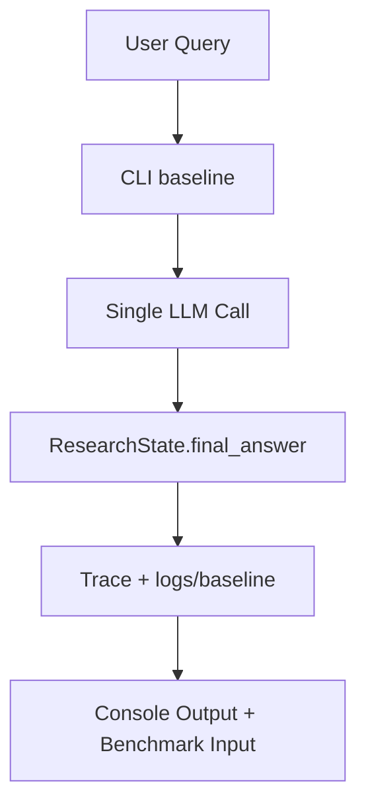
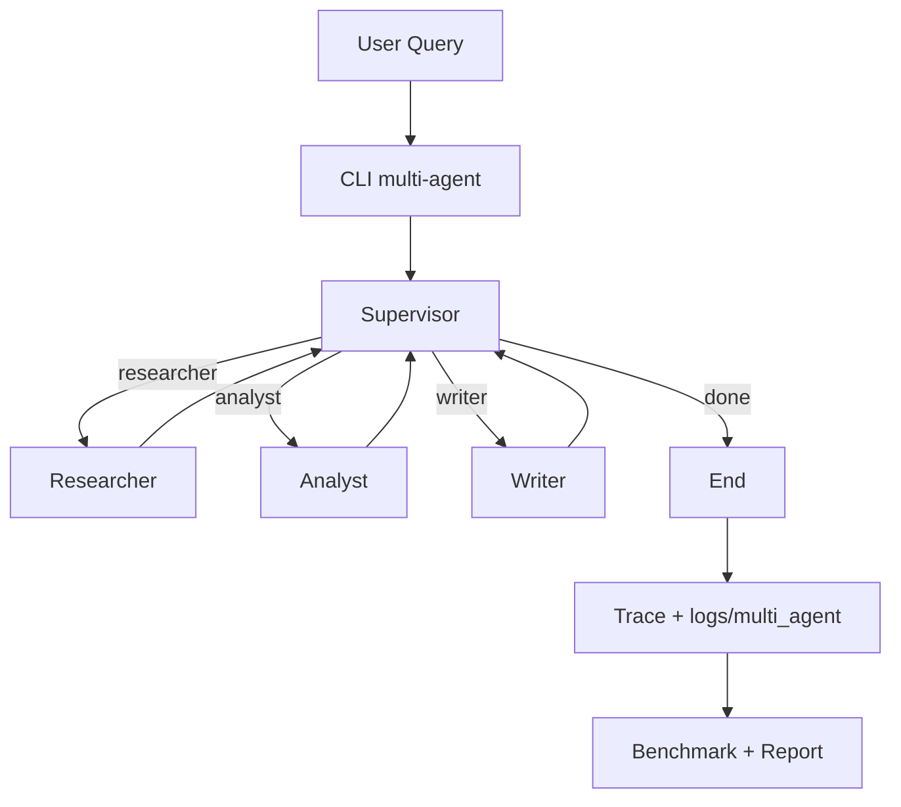

# Design Template

## Problem

Xây dựng research assistant có thể xử lý truy vấn dài và nhiều bước theo quy trình:
1. Thu thập thông tin có nguồn.
2. Tổng hợp và phân tích luận điểm.
3. Viết câu trả lời cuối theo audience mục tiêu.

Hệ thống cần chạy được ở 2 chế độ:
- Baseline single-agent để làm mốc so sánh.
- Multi-agent orchestration để tăng khả năng kiểm soát chất lượng và traceability.

## Why multi-agent?

Single-agent phù hợp cho câu hỏi ngắn, nhưng với bài research dài thường gặp các vấn đề:
- Trộn lẫn nhiệm vụ search, analysis, writing trong một prompt làm output thiếu cấu trúc.
- Khó debug khi chất lượng thấp (không biết hỏng ở bước nào).
- Khó benchmark theo từng năng lực thành phần.

Multi-agent giải quyết bằng cách tách role rõ ràng:
- Supervisor điều phối và dừng đúng lúc.
- Researcher tập trung tìm nguồn và trích dẫn.
- Analyst tập trung so sánh, kiểm định luận điểm.
- Writer tập trung tổng hợp thành câu trả lời cuối.

Đổi lại, multi-agent tăng độ phức tạp orchestration và chi phí vận hành. Vì vậy cần benchmark với baseline để quyết định có đáng dùng hay không.

## Agent roles

| Agent | Responsibility | Input | Output | Failure mode |
|---|---|---|---|---|
| Supervisor | Chọn bước kế tiếp và điều kiện dừng | `request`, `route_history`, các notes hiện có, `errors`, `iteration` | route kế tiếp: `researcher`/`analyst`/`writer`/`done` | Loop vô hạn, route sai thứ tự, dừng sớm |
| Researcher | Tìm nguồn và tạo research notes có citation | `request.query`, `max_sources`, search client | `sources`, `research_notes`, `agent_results` | Không tìm được nguồn, nguồn kém chất lượng, timeout API |
| Analyst | Phân tích và đối chiếu nguồn thành luận điểm | `research_notes`, `sources` | `analysis_notes`, `agent_results` | Hallucination, diễn giải sai nguồn, thiếu phản biện |
| Writer | Tổng hợp final answer theo audience | `request.audience`, `research_notes`, `analysis_notes` | `final_answer`, `agent_results` | Bỏ sót ý chính, văn phong không phù hợp, thiếu citation mapping |

## Shared state

Nguồn sự thật duy nhất là `ResearchState` trong `core/state.py`:

- `request`: input chuẩn hóa (`query`, `max_sources`, `audience`).
- `iteration`: đếm vòng điều phối để enforce `max_iterations`.
- `route_history`: lịch sử route phục vụ debug và benchmark.
- `sources`: danh sách nguồn thu thập.
- `research_notes`: ghi chú research thô từ Researcher.
- `analysis_notes`: tổng hợp và nhận định từ Analyst.
- `final_answer`: đầu ra cuối do Writer tạo.
- `agent_results`: nhật ký output có cấu trúc theo từng agent.
- `trace`: trace events/spans để replay.
- `errors`: lỗi tích lũy để fallback và hậu kiểm.

Quy tắc handoff:
1. Supervisor chỉ quyết định route, không ghi đè nội dung worker.
2. Worker chỉ update các field thuộc phạm vi role.
3. Writer chỉ chạy khi đã có đủ ngữ cảnh (ít nhất `research_notes` hoặc `analysis_notes`).

## Routing policy

### Baseline flow

### Multi-agent flow

### Supervisor decision policy (khuyến nghị)

1. Nếu `iteration >= max_iterations`: route `done` và ghi lỗi guardrail.
2. Nếu `sources` trống hoặc `research_notes` trống: route `researcher`.
3. Nếu có `research_notes` nhưng chưa có `analysis_notes`: route `analyst`.
4. Nếu đã có `analysis_notes` nhưng chưa có `final_answer`: route `writer`.
5. Nếu đã có `final_answer`: route `done`.

Fallback policy:
- Nếu worker fail liên tiếp >= 2 lần, Supervisor chuyển route khác hoặc kết thúc với partial answer.
- Nếu timeout tổng workflow, kết thúc an toàn và lưu trace + errors.

## Guardrails

- Max iterations:
- `Settings.max_iterations` (mặc định 6). Stop khi vượt ngưỡng.
- Timeout:
- `Settings.timeout_seconds` cho mỗi run; timeout tại LLM/search call và toàn workflow.
- Retry:
- Retry có backoff cho LLM/search (ví dụ `tenacity`, 2-3 lần).
- Fallback:
- Baseline fallback trả câu trả lời ngắn + cảnh báo thiếu dữ liệu.
- Multi-agent fallback cho phép kết thúc với `analysis_notes` nếu Writer lỗi.
- Validation:
- Validate input query qua `ResearchQuery`.
- Validate output tối thiểu: `final_answer` không rỗng khi route `done` (trừ trường hợp fallback có lỗi ghi nhận).
- Validate source quality cơ bản: URL hợp lệ hoặc snippet không rỗng.

## Tracing and log persistence

Mục tiêu: tách log theo chế độ chạy để dễ benchmark và replay.

- Baseline logs: `logs/baseline/`
- Multi-agent logs: `logs/multi_agent/`

Mỗi run tạo 1 file timestamp (jsonl khuyến nghị), ví dụ:
- `logs/baseline/run_20260506_093015.jsonl`
- `logs/multi_agent/run_20260506_094102.jsonl`

Mỗi record nên có:
- `timestamp`
- `run_id`
- `run_type` (`baseline` hoặc `multi_agent`)
- `span_name`
- `agent` (nếu có)
- `duration_seconds`
- `input_summary`
- `output_summary`
- `error`
- `token_usage` và `estimated_cost_usd` (nếu có)

Nguyên tắc:
1. Không log API key hoặc raw secret.
2. Có thể truncate nội dung dài trong `input_summary`/`output_summary`.
3. Ghi log ngay cả khi fail để hỗ trợ post-mortem.

## Benchmark plan

### Query set

1. "Research GraphRAG state-of-the-art and write a 500-word summary."
2. "Compare RAG vs GraphRAG for enterprise search with 3 trade-offs."
3. "Explain when multi-agent systems are overkill in production."

### Metrics

- `latency_seconds`: wall-clock cho mỗi run.
- `estimated_cost_usd`: ước lượng theo token usage/provider usage.
- `quality_score` (0-10): chấm theo rubric peer review.
- `citation_coverage`: claims có nguồn / tổng claims chính.
- `failure_rate`: số run fail / tổng run.

### Expected outcome

- Baseline: latency thấp hơn nhưng quality/citation coverage trung bình.
- Multi-agent: quality và citation coverage cao hơn, đổi lại latency và cost tăng.
- Quyết định cuối: chỉ dùng multi-agent khi bài toán cần traceability + quality ổn định trên truy vấn phức tạp.

### Verification checklist

1. Chạy baseline và multi-agent cùng query set.
2. Lưu đầy đủ log trong đúng folder `logs/baseline` và `logs/multi_agent`.
3. Tổng hợp metrics vào `reports/benchmark_report.md`.
4. Đính kèm trace screenshot/link trong deliverables.
